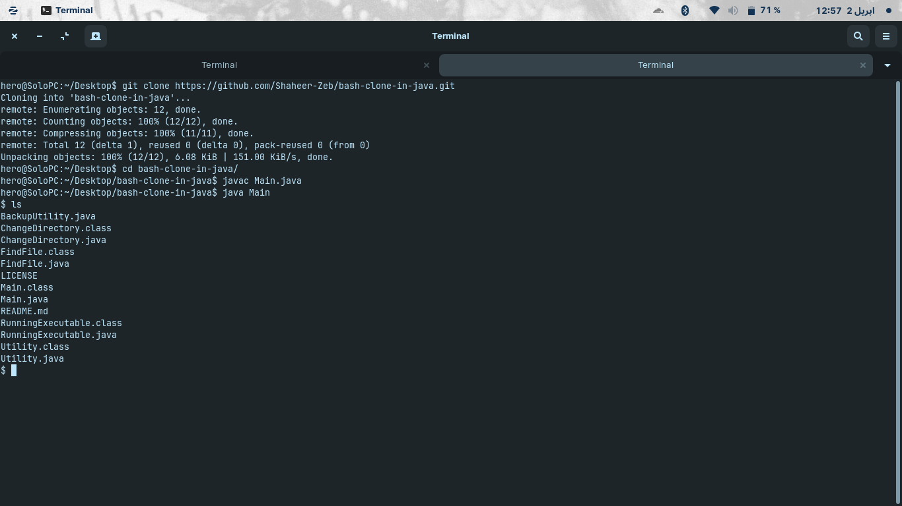

# Bash (Shell) Clone Made Using Java
Note that this is no way a complete clone of Bash; however, the basic functionalities are implemented.
## How To Run?
1. Clone the repo

   ```git clone https://github.com/Shaheer-Zeb/bash-clone-in-java.git```

2. cd to the folder

   ```cd bash-clone-in-java```

3. Compile the classes

   ```javac Main.java```

4. Run the program

   ```java Main```


## Functionalities
A few shell built-in commands are implemented in this clone:

1. exit
2. echo
3. type
4. pwd
5. cd
6. whothehellami (my flavor of 'whoami' command)

Apart from that, the clone can run any executable (like ls, mkdir, cat, etc.) available either in the current working directory or the PATH. 

And the command parser supports single and double quotes.

## Missing Features
1. Piping (albeit an imperative feature of the UNIX environment, this clone doesn't have it yet).
2. Command and file completion.
3. Command history.

I hope to implement them soon.
